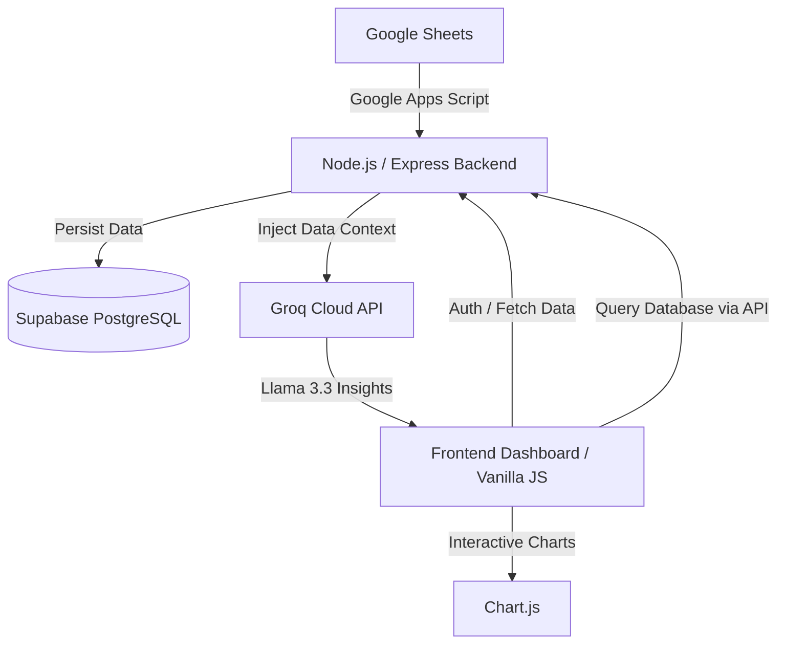

# Country House - Business Intelligence & AI Analytics Dashboard

[Español](#español) | [English](#english)

---

## Español

> **Nota:** Este es un repositorio p˙blico de Portafolio / Demo. Todos los datos financieros y de inventario han sido anonimizados o sustituidos por datos ficticios para proteger la confidencialidad de la operaciÛn real.`r`n`r`nEste proyecto es una plataforma de **Business Intelligence (BI) y anal√≠tica con Inteligencia Artificial** a medida, dise√±ada para optimizar la gesti√≥n de inventario, el control de mermas y el an√°lisis de estados financieros (P&L) de la tienda **Country House Santo Domingo** (Costa Rica).

El sistema consolida los datos de venta y existencias, sincroniz√°ndolos autom√°ticamente con Google Sheets y Supabase, ofreciendo una interfaz visual interactiva y un asistente inteligente de consultas de negocio impulsado por la API de Groq Cloud.

### 🚀 Características Principales

*   **Dashboard Interactivo:** Visualizaciones din√°micas de ventas brutas, rentabilidad, costo de mermas y valor total de inventario a precio de costo.
*   **Asistente IA de Consulta (Groq Cloud):** Un agente virtual inteligente integrado (impulsado por `llama-3.3-70b-versatile`) que analiza el stock actual en tiempo real para sugerir órdenes de compra, detectar excesos de inventario y responder preguntas en lenguaje natural con tono amigable.
*   **Sincronización Automatizada:** Conector directo mediante Google Apps Script para importar datos desde hojas de cálculo a una base de datos centralizada.
*   **Seguridad y Roles:** Autenticación robusta basada en JWT con vistas diferenciadas para Administradores, Gerencia y Visores.
*   **Latido Automatizado (Keep-Alive):** Configuración de endpoints de salud integrados para evitar que los servidores de hospedaje gratuito se duerman durante el horario comercial.

### 🛠️ Tecnologías Utilizadas

*   **Frontend:** HTML5, Vanilla CSS3 (Custom Properties & Glassmorphism), JavaScript (ES6+), Chart.js (Gr√°ficas interactivas).
*   **Backend:** Node.js, Express.js, JWT (JsonWebToken) para autenticación.
*   **Base de Datos:** PostgreSQL (Alojado en Supabase Cloud).
*   **Servicio de IA:** Groq Cloud API (`llama-3.3-70b-versatile`).

---

## English

This project is a bespoke **Business Intelligence (BI) and AI-driven Analytics Dashboard** designed to optimize inventory management, shrinkage control, and financial statement (P&L) analysis for the **Country House Santo Domingo** retail store (Costa Rica).

The system consolidates sales and stock data, syncing it automatically from Google Sheets to a Supabase database, offering an interactive visual UI and an AI-powered natural language business assistant using the Groq Cloud API.

### üöÄ Key Features

*   **Interactive BI Dashboard:** Live visualizations of gross sales, net margins, shrinkage costs, and total inventory value at cost price.
*   **AI Business Assistant (Groq Cloud):** An integrated conversational agent (powered by `llama-3.3-70b-versatile`) that reviews live stock data to suggest purchase orders, detect inventory excess, and answer business queries in a friendly, conversational tone.
*   **Automated Data Sync:** Integration with Google Apps Script to import ledger sheets into the central database.
*   **Role-Based Security:** Secure JWT-based authentication featuring custom views for Administrators, Managers, and Viewers.
*   **Server Keep-Alive (Ping):** Built-in health endpoints designed to optimize free-tier hosting limits by keeping the server active during business hours.

### 🛠️ Tech Stack

*   **Frontend:** HTML5, Vanilla CSS3 (Custom Variables & Glassmorphism), JavaScript (ES6+), Chart.js (Data visualizations).
*   **Backend:** Node.js, Express.js, JWT (JsonWebToken) for security.
*   **Database:** PostgreSQL (Hosted on Supabase Cloud).
*   **AI Integration:** Groq Cloud API (`llama-3.3-70b-versatile`).

---

## üîí Seguridad Aplicada / Applied Security

### Español
La plataforma implementa un modelo de seguridad robusto de extremo a extremo, diseñado bajo estándares de desarrollo seguro para proteger la integridad de los datos financieros:

1.  **Autenticación y Autorización por Capas (JWT):**
    *   Toda la API del backend (`/api/*`) se encuentra protegida bajo autenticación mediante tokens firmados JWT.
    *   Se implementa control de acceso basado en roles (RBAC: Administrador, Gerencia y Visor). Los endpoints críticos requieren rol de Administrador.
    *   **Política de Contraseñas Seguras:** Se exige un mínimo de 8 caracteres para la creación y modificación de usuarios.
    *   **Protección contra Ataques de Fuerza Bruta (DoS):** Se implementó un limitador de peticiones (Rate Limit) exclusivo en el endpoint de autenticación para mitigar intentos masivos de inicio de sesión.
2.  **Mitigación de Cross-Site Scripting (XSS):**
    *   **XSS en Interfaz Conversacional:** Las respuestas generadas por la IA son escapadas estrictamente en el cliente.
    *   **XSS Almacenado en Tablas (DOM):** Todos los datos provenientes de la base de datos (Inventario, Mermas, Estado de Resultados y Usuarios) son sanitizados antes de inyectarse en el DOM (`innerHTML`), previniendo la ejecución de scripts maliciosos.
3.  **Prevención de Server-Side Request Forgery (SSRF):**
    *   El endpoint de sincronización restringe estrictamente (mediante expresiones regulares) que la URL de origen corresponda únicamente a servidores legítimos de Google Sheets.
4.  **Cabeceras HTTP de Seguridad:**
    *   Se utiliza `helmet` para proteger contra Clickjacking y MIME-sniffing, junto con una Política de Seguridad de Contenidos (CSP) restringida.
5.  **Acceso Seguro y Gateway a Supabase:**
    *   El backend actúa como un filtro privado usando consultas preparadas, previniendo la inyección SQL.

### English
The platform features a secure development architecture designed to protect sensitive financial data across all components:

1.  **Layered JWT Authentication, RBAC & Hardening:**
    *   All backend endpoints enforce secure token-based JWT authentication.
    *   Critical administration routes require active Administrator privileges.
    *   **Password Policy:** Minimum length of 8 characters enforced for all accounts.
    *   **Anti-Brute Force (DoS):** Dedicated rate limiting on authentication endpoints.
2.  **Cross-Site Scripting (XSS) Defenses:**
    *   **Conversational UI XSS:** AI responses are strictly HTML-escaped.
    *   **Stored XSS on DOM rendering:** All database records are sanitized before DOM interpolation, blocking persistent XSS attacks across data tables.
3.  **Server-Side Request Forgery (SSRF) Prevention:**
    *   Synchronization endpoints strictly validate remote URLs to ensure they belong to authorized Google Sheets domains.
4.  **HTTP Security Headers:**
    *   Express is hardened with `helmet` providing anti-clickjacking and a strict Content Security Policy (CSP).
5.  **Supabase Private Gateway:**
    *   Database transactions run exclusively via the Node backend using sanitized PostgreSQL parameters, neutralizing SQL injection vectors.

---

## üìê Architecture / Arquitectura



---

## 💻 Local Setup / Instalación Local

### Prerequisites / Requisitos
*   Node.js (v18.0.0 or higher / o superior)
*   NPM

### Installation / Pasos para instalar

1.  **Clone the repository / Clonar el repositorio:**
    ```bash
    git clone https://github.com/YOUR_USERNAME/country-house-bi-dashboard.git
    cd country-house-bi-dashboard
    ```
2.  **Install dependencies / Instalar dependencias:**
    ```bash
    npm install
    ```
3.  **Environment Variables / Variables de entorno (`.env`):**
    Create a `.env` file in the root folder / Crea un archivo `.env` en la raíz con las siguientes variables:
    ```env
    PORT=3000
    DATABASE_URL=postgresql://your_postgres_credentials
    JWT_SECRET=your_secure_random_jwt_secret
    GROQ_API_KEY=gsk_your_groq_api_key_here
    ```
4.  **Run the application / Iniciar la aplicación:**
    ```bash
    npm run dev
    ```
    Open / Abre `http://localhost:3000` in your browser.
